# 高校教师培训管理系统 (Teacher Training Management System)

基于 **Vue 3** + **TypeScript** + **Node.js** 的全栈式高校教师培训管理解决方案。旨在帮助高校高效管理教师培训计划、在线考试、学时认定及数据统计。

## 🌟 核心功能

### 1. 👥 用户与角色管理
- **多角色支持**：管理员、讲师、教师（学员）。
- **权限控制**：基于 RBAC 的权限管理，不同角色拥有不同的菜单和操作权限。

### 2. 📅 培训全流程管理
- **计划发布**：讲师/管理员可发布培训计划，支持富文本详情、封面上传、资料附件（集成 MinIO）。
- **报名审核**：教师在线报名，讲师/管理员进行审核（支持通过/拒绝）。
- **签到考勤**：管理学员的签到状态（出勤/缺席/请假）。

### 3. 📝 在线考试系统
- **题库管理**：支持单选、多选、判断题的录入与管理。
- **考试发布**：支持独立考试或关联培训项目的结业考试，设置考试时长、及格分。
- **在线答题**：学员在线参加考试，系统自动判分。
- **学时联动**：考试及格后自动计算并发放相应学时。

### 4. 📊 数据可视化仪表盘
- **管理员视角**：全校师资培训概览、实时待办事项。
- **讲师视角**：负责课程的报名趋势分析（ECharts 折线图）、培训类型分布（饼图）。
- **教师视角**：个人年度学时统计、学时来源分布（培训/考试）、待考项目提醒。

### 5. 💬 互动与反馈
- **消息中心**：内置即时通讯模块，支持学员与讲师一对一沟通。
- **证书体系**：培训完成或考试通过后，系统自动生成并提供证书预览/下载。

## 🛠 技术栈

### 前端 (Client)
- **核心框架**: Vue 3 + TypeScript
- **构建工具**: Vite
- **UI 组件库**: Element Plus
- **状态管理**: Pinia
- **路由管理**: Vue Router
- **图表库**: ECharts
- **HTTP 请求**: Axios

### 后端 (Server)
- **运行环境**: Node.js
- **Web 框架**: Express
- **ORM 框架**: Sequelize
- **数据库**: MySQL 8.0+
- **缓存/会话**: Redis
- **文件存储**: MinIO
- **身份认证**: JWT (JSON Web Token)

## 🚀 快速开始

### 环境要求
- Node.js >= 16
- MySQL >= 8.0
- Redis
- MinIO (可选，用于文件上传)

### 1. 克隆项目
```bash
git clone <repository-url>
cd teacher-training-system
```

### 2. 数据库配置
1. 创建 MySQL 数据库 `teacher_training`。
2. 导入初始化脚本 `server/database.sql`。
3. 修改后端配置文件 `server/.env` (如不存在请参考 `.env.example`) 配置数据库连接。

### 3. 启动后端服务
```bash
cd server
npm install
npm start
# 服务默认运行在 http://localhost:3000
```

### 4. 启动前端服务
```bash
# 回到项目根目录
npm install
npm run dev
# 访问 http://localhost:5173
```

## 📂 项目结构

```
├── public/              # 静态资源
├── server/              # 后端服务代码
│   ├── config/          # 配置文件
│   ├── controllers/     # 控制器 (业务逻辑)
│   ├── middleware/      # 中间件 (Auth, Upload 等)
│   ├── models/          # Sequelize 模型定义
│   ├── routes/          # API 路由
│   ├── utils/           # 工具类 (Redis, MinIO 等)
│   └── app.js           # 入口文件
├── src/                 # 前端源码
│   ├── api/             # API 接口封装
│   ├── assets/          # 静态资源
│   ├── components/      # 公共组件
│   ├── layouts/         # 布局组件
│   ├── router/          # 路由配置
│   ├── stores/          # Pinia 状态管理
│   ├── utils/           # 前端工具函数
│   ├── views/           # 页面视图
│   └── App.vue          # 根组件
├── .env                 # 环境变量
└── README.md            # 项目说明
```

## 管理端

### 首页

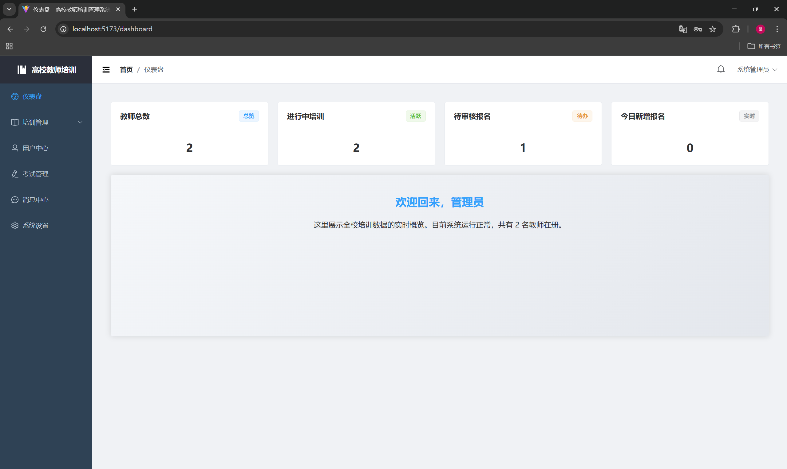

### 培训管理

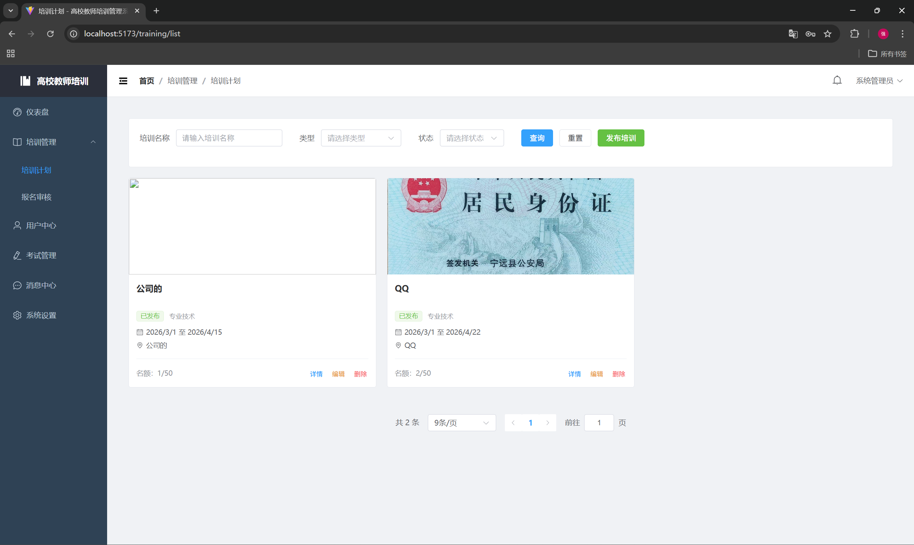

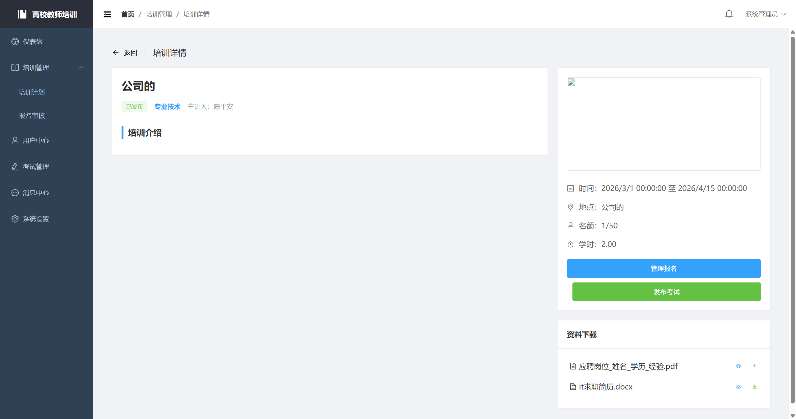

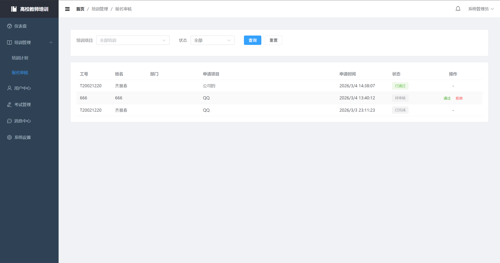

### 用户中心

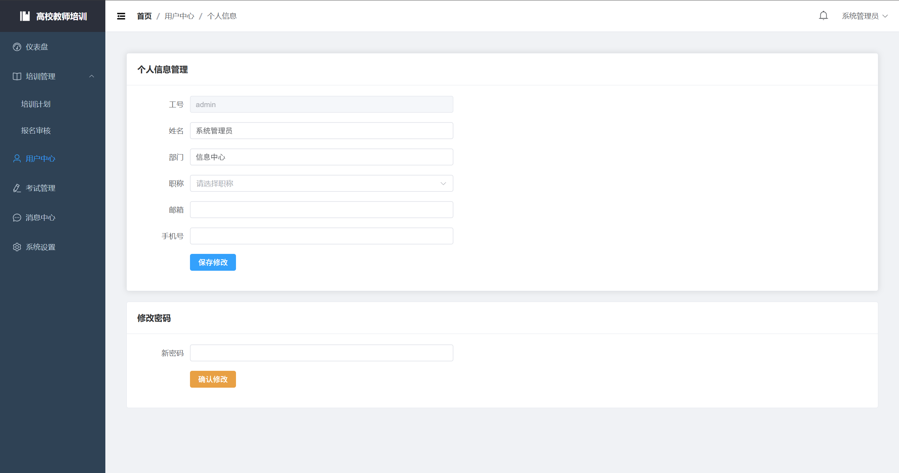

### 考试管理

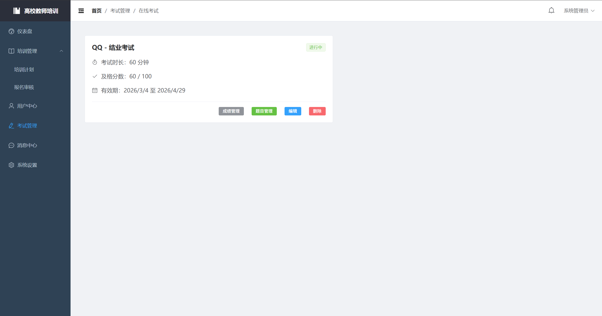

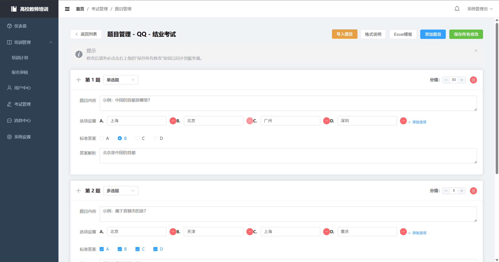

### 消息中心

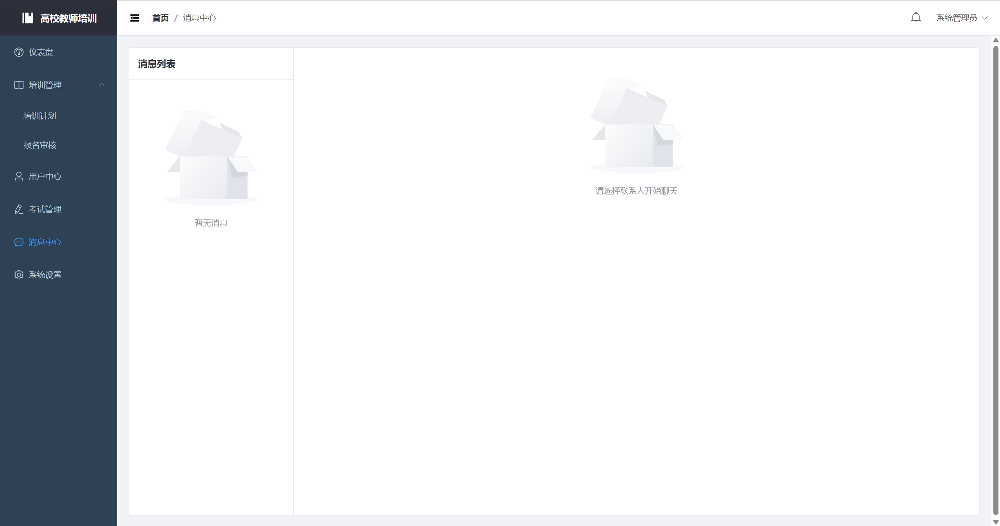

### 系统设置

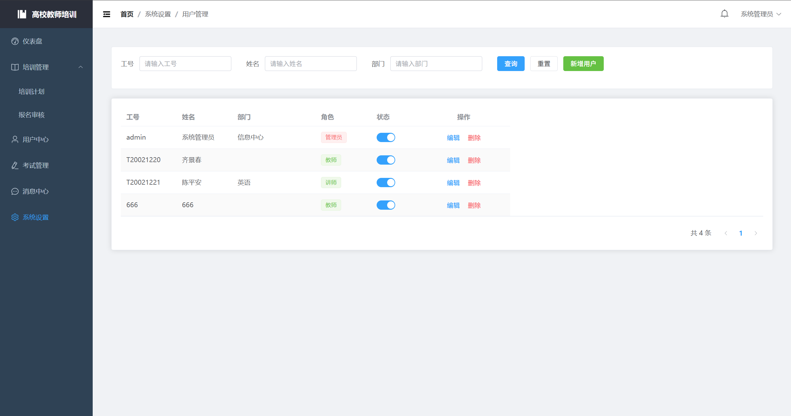

## 讲师端

### 首页

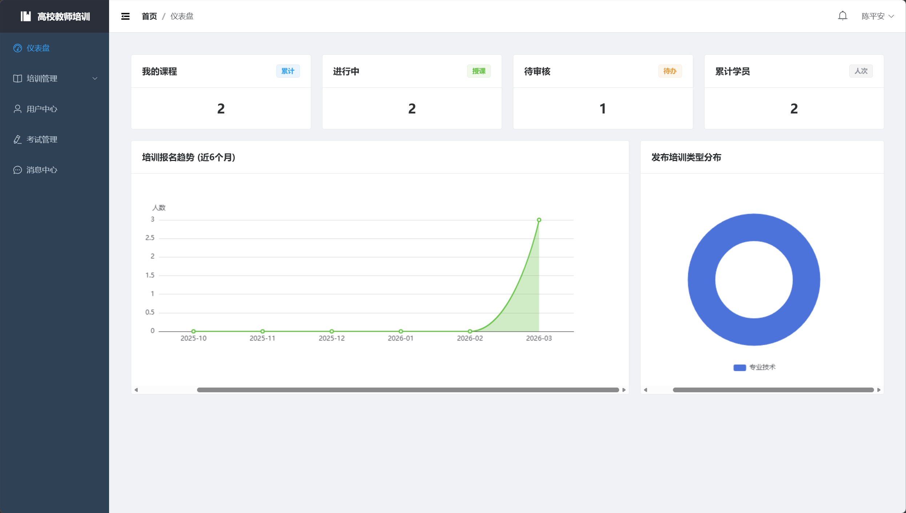

### 其余的与管理员基本无异，唯一的区别就是管理员可查看所有培训计划、报名审核、考试管理，而讲师只可查看自己发布的培训计划、报名审核、考试管理

### 消息中心

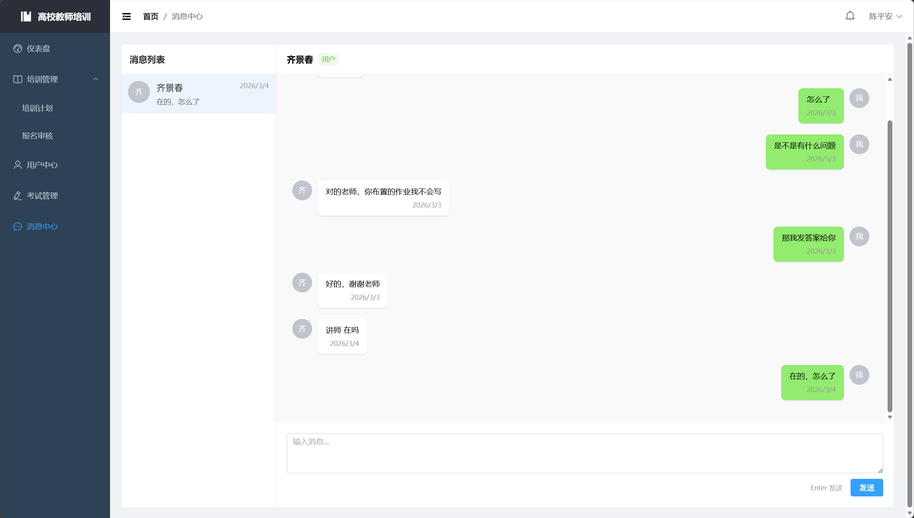

## 教师端

### 首页

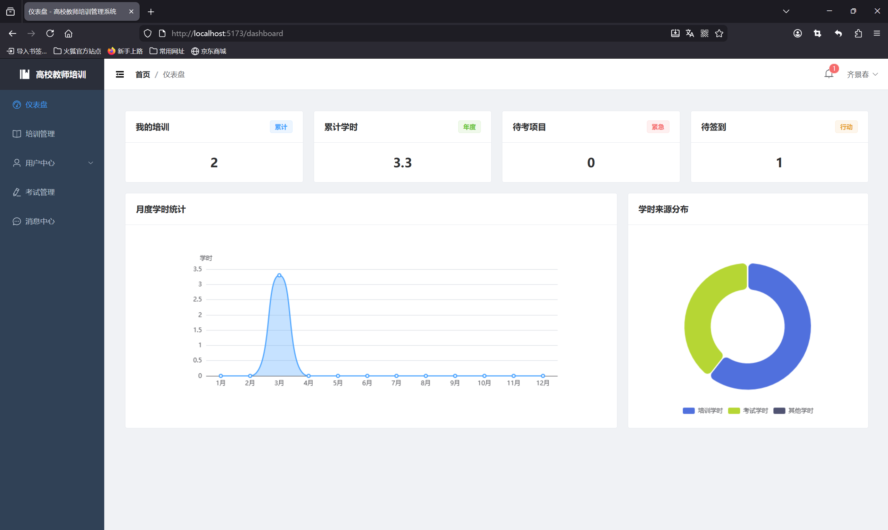

### 我的学时

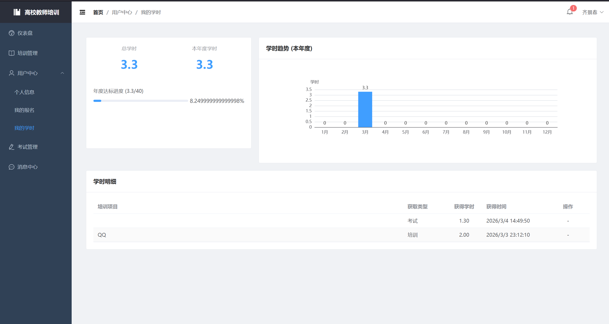

### 其他的页面跟教师端无异，但是不能修改、删除

## 📄 许可证

MIT License
